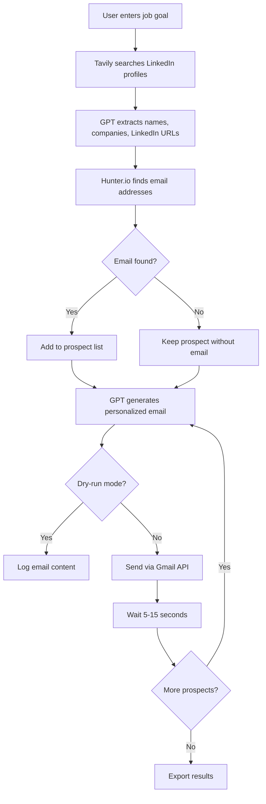
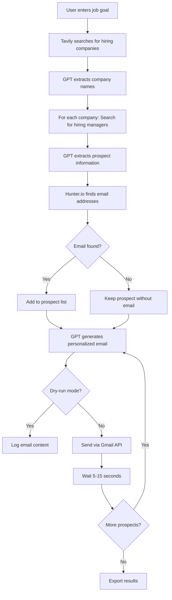

# AI Job Seeker Agent - Project Workflow Documentation

> **For Newcomers**: This document explains how the AI Job Seeker Agent works, its architecture, and the complete workflow from start to finish.

---

## 📋 Table of Contents

1. [Project Overview](#project-overview)
2. [System Architecture](#system-architecture)
3. [How It Works](#how-it-works)
4. [Detailed Workflow](#detailed-workflow)
5. [Component Breakdown](#component-breakdown)
6. [API Integrations](#api-integrations)
7. [Data Flow](#data-flow)
8. [Configuration & Setup](#configuration--setup)
9. [Usage Examples](#usage-examples)
10. [Troubleshooting Guide](#troubleshooting-guide)

---

## 🎯 Project Overview

### What is this project?

The **AI Job Seeker Agent** is an intelligent automation tool that helps job seekers, freelancers, and students find and reach out to potential employers. It automates the entire process of:

- 🔍 Finding companies that are hiring
- 👥 Discovering hiring managers and recruiters
- 📧 Finding their email addresses
- ✉️ Sending personalized outreach emails

### Why use it?

Job hunting is time-consuming. This tool automates the repetitive tasks so you can focus on preparing for interviews and building your skills.

### Key Features

- **Two Search Approaches**: LinkedIn-focused (faster) or company-based (comprehensive)
- **AI-Powered**: Uses GPT-4 for intelligent data extraction and email generation
- **Web Interface**: Modern web app for easy interaction
- **CLI Support**: Command-line interface for automation
- **Gmail OAuth**: Secure email sending via Gmail API
- **Rate Limiting**: Respects API limits automatically
- **Dry-Run Mode**: Test before sending real emails

---

## 🏗️ System Architecture

```
┌─────────────────────────────────────────────────────────────┐
│                     USER INTERFACE                          │
│  ┌──────────────────┐         ┌──────────────────┐        │
│  │   Web App        │         │   CLI (main.py)  │        │
│  │  (Flask + JS)    │         │   Command Line   │        │
│  └────────┬─────────┘         └────────┬─────────┘        │
└───────────┼──────────────────────────────┼─────────────────┘
            │                              │
            └──────────────┬───────────────┘
                           │
┌──────────────────────────┼─────────────────────────────────┐
│                    CORE AGENTS                              │
│  ┌─────────────────┐  ┌─────────────────┐  ┌────────────┐ │
│  │ Tavily Agent    │  │ Hunter Agent    │  │Email Agent │ │
│  │ (Search)        │  │ (Email Finding) │  │(Sending)   │ │
│  └────────┬────────┘  └────────┬────────┘  └─────┬──────┘ │
└───────────┼──────────────────────┼──────────────────┼───────┘
            │                      │                  │
┌───────────┼──────────────────────┼──────────────────┼───────┐
│                    EXTERNAL APIs                            │
│  ┌─────────────────┐  ┌─────────────────┐  ┌────────────┐ │
│  │ Tavily AI       │  │ Hunter.io       │  │Gmail API   │ │
│  │ (Web Search)    │  │ (Email Lookup)  │  │(OAuth2)    │ │
│  └─────────────────┘  └─────────────────┘  └────────────┘ │
│  ┌─────────────────┐                                       │
│  │ OpenAI GPT-4    │                                       │
│  │ (AI Processing) │                                       │
│  └─────────────────┘                                       │
└─────────────────────────────────────────────────────────────┘
```

### Architecture Layers

1. **User Interface Layer**: Web app (Flask) and CLI for user interaction
2. **Agent Layer**: Three specialized agents handling different tasks
3. **API Layer**: External services for search, email finding, and sending
4. **Data Layer**: Models for Company and Prospect data structures

---

## 🔄 How It Works

### Two Approaches

#### 1. LinkedIn-Focused Approach (Recommended - Faster)

```
User Input → Search LinkedIn Profiles → Find Emails → Send Emails
   (Goal)         (Tavily + GPT)       (Hunter.io)   (Gmail API)
```

**Best for**: Quick searches, targeting specific roles

#### 2. Company-Based Approach (Comprehensive)

```
User Input → Find Companies → Find Prospects → Find Emails → Send Emails
   (Goal)    (Tavily + GPT)   (Tavily + GPT)   (Hunter.io)   (Gmail API)
```

**Best for**: Broader searches, exploring multiple companies

---

## 📊 Detailed Workflow

### LinkedIn-Focused Workflow



### Company-Based Workflow



---

## 🧩 Component Breakdown

### 1. Main Entry Point (`main.py`)

**Purpose**: Orchestrates the entire workflow

**Key Classes**:
- `JobSeekerAgent`: Main orchestrator class

**Key Methods**:
- `step1_search_companies()`: Find companies hiring
- `step2_search_prospects()`: Find hiring managers at companies
- `step3_find_emails()`: Discover email addresses
- `step4_send_emails()`: Generate and send emails
- `run_linkedin_approach()`: Execute LinkedIn-focused workflow
- `run()`: Execute company-based workflow

**Command-Line Arguments**:
```bash
--goal              # Your job search goal (required)
--linkedin          # Use LinkedIn approach
--max-companies     # Max companies to search
--max-prospects     # Max prospects per company
--dry-run           # Test without sending
--template          # Custom email template
--export-format     # json or csv
--days              # Filter to last N days
```

### 2. Tavily Agent (`agents/tavily_agent.py`)

**Purpose**: Web search and data extraction

**Key Features**:
- Searches web using Tavily AI
- Filters results by date (last N days)
- Uses GPT-4 to extract structured data
- Rate limiting (5 requests/second)

**Key Methods**:
- `search_companies()`: Find companies hiring
- `search_prospects()`: Find hiring managers at a company
- `search_linkedin_profiles()`: Direct LinkedIn profile search
- `_extract_companies_with_gpt()`: Extract company names using AI
- `_extract_prospects_with_gpt()`: Extract prospect info using AI
- `_filter_results_by_date()`: Filter search results by date

**Data Flow**:
```
Search Query → Tavily API → Raw Results → Date Filter → 
GPT Processing → Structured Data (Companies/Prospects)
```

### 3. Hunter Agent (`agents/hunter_agent.py`)

**Purpose**: Email address discovery

**Key Features**:
- Finds email addresses using Hunter.io API
- Validates email format and confidence scores
- Falls back to domain search if direct lookup fails
- Rate limiting (10 requests/second)

**Key Methods**:
- `find_email()`: Find email for a prospect
- `_domain_search()`: Search by domain as fallback
- `_guess_domain()`: Guess company domain from name

**Email Finding Process**:
```
Prospect Info → Hunter.io Email Finder → 
Confidence Score Check (≥50%) → Validation → Email Address
```

### 4. Email Agent (`agents/email_agent.py`)

**Purpose**: Email generation and sending

**Key Features**:
- Generates personalized emails using GPT-4
- Sends via Gmail API (OAuth2)
- Bulk sending with human-like delays (5-15 seconds)
- Dry-run mode for testing

**Key Methods**:
- `generate_email()`: Create personalized email content
- `send_email()`: Send single email via Gmail
- `generate_and_send()`: Combined generation and sending
- `send_bulk_emails()`: Send to multiple prospects with delays
- `enhance_prompt()`: Improve email prompts using GPT

**Email Generation Process**:
```
Prospect Info + User Info + Template → 
GPT-4 Processing → Personalized Email → 
Gmail API → Sent Email
```

### 5. Web Application (`app.py`)

**Purpose**: Provides web interface for the agent

**Key Features**:
- Flask REST API
- Session-based state management
- Real-time status updates
- Gmail OAuth authentication

**API Endpoints**:

| Endpoint | Method | Purpose |
|----------|--------|---------|
| `/` | GET | Serve web interface |
| `/api/search` | POST | Search for prospects |
| `/api/prospect/<id>` | GET | Get prospect details |
| `/api/send-email/<id>` | POST | Send email to one prospect |
| `/api/send-emails` | POST | Send emails to all prospects |
| `/api/oauth/authenticate` | POST | Start Gmail OAuth flow |
| `/api/oauth/check` | POST | Check authentication status |
| `/api/status` | GET | Get current processing status |
| `/api/reset` | POST | Reset session data |

**Web App Flow**:
```
User fills form → Search prospects → View results → 
Authenticate Gmail → Send emails → View status
```

### 6. Data Models (`models/prospect.py`)

**Purpose**: Define data structures

**Classes**:

**Company**:
```python
@dataclass
class Company:
    name: str
    domain: Optional[str] = None
```

**Prospect**:
```python
@dataclass
class Prospect:
    first_name: str
    last_name: str
    company_name: str
    company_domain: Optional[str] = None
    linkedin_profile: Optional[str] = None
    email: Optional[str] = None
    job_title: Optional[str] = None
```

### 7. Utilities

**Logger (`utils/logger.py`)**:
- Configures logging to console and file
- Formats log messages with timestamps
- Separate log file per day

**Validators (`utils/validators.py`)**:
- Email validation
- Domain extraction
- Name parsing

**Gmail OAuth (`utils/gmail_oauth.py`)**:
- Handles Gmail OAuth2 authentication
- Manages token storage and refresh
- Sends emails via Gmail API

---

## 🔌 API Integrations

### 1. Tavily AI (Web Search)

**What it does**: Searches the web for job-related information

**API Calls**:
```python
client.search(
    query="Software Engineer jobs",
    max_results=50,
    search_depth="advanced",
    days=45  # Last 45 days
)
```

**Response**: List of search results with titles, content, URLs, and dates

**Rate Limit**: 5 requests/second

### 2. Hunter.io (Email Finding)

**What it does**: Finds email addresses for people at companies

**API Calls**:
```python
# Email Finder
GET https://api.hunter.io/v2/email-finder
?domain=company.com
&first_name=John
&last_name=Doe

# Domain Search (fallback)
GET https://api.hunter.io/v2/domain-search
?domain=company.com
&seniority=senior
```

**Response**: Email address with confidence score

**Rate Limit**: 10 requests/second

### 3. OpenAI GPT-4 (AI Processing)

**What it does**: Extracts structured data and generates emails

**Use Cases**:
1. Extract company names from search results
2. Extract prospect information (names, titles, LinkedIn)
3. Generate personalized email content
4. Enhance email prompts

**API Call Example**:
```python
client.chat.completions.create(
    model="gpt-4o-mini",
    messages=[
        {"role": "system", "content": "You are a helpful assistant..."},
        {"role": "user", "content": "Extract company names from..."}
    ],
    temperature=0.3
)
```

### 4. Gmail API (Email Sending)

**What it does**: Sends emails via Gmail using OAuth2

**Authentication**: OAuth2 flow (no password needed)

**API Call**:
```python
service.users().messages().send(
    userId='me',
    body=message
).execute()
```

**Benefits**:
- More secure than SMTP
- No app passwords needed
- Better deliverability

---

## 📈 Data Flow

### Complete Data Flow Diagram

```
┌──────────────┐
│  User Input  │
│  (Job Goal)  │
└──────┬───────┘
       │
       ▼
┌──────────────────────────────────────────────────────┐
│              STEP 1: SEARCH                          │
│  ┌────────────┐    ┌──────────┐    ┌─────────────┐ │
│  │ Tavily API │ -> │ Raw HTML │ -> │ GPT Extract │ │
│  └────────────┘    └──────────┘    └──────┬──────┘ │
└─────────────────────────────────────────────┼────────┘
                                              │
                                              ▼
                                    ┌──────────────────┐
                                    │ Companies/       │
                                    │ Prospects List   │
                                    └────────┬─────────┘
                                             │
       ┌─────────────────────────────────────┘
       │
       ▼
┌──────────────────────────────────────────────────────┐
│           STEP 2: EMAIL FINDING                      │
│  ┌────────────┐    ┌──────────┐    ┌─────────────┐ │
│  │ Hunter API │ -> │ Email +  │ -> │ Validation  │ │
│  └────────────┘    │ Score    │    └──────┬──────┘ │
└─────────────────────────────────────────────┼────────┘
                                              │
                                              ▼
                                    ┌──────────────────┐
                                    │ Prospects with   │
                                    │ Email Addresses  │
                                    └────────┬─────────┘
                                             │
       ┌─────────────────────────────────────┘
       │
       ▼
┌──────────────────────────────────────────────────────┐
│         STEP 3: EMAIL GENERATION                     │
│  ┌────────────┐    ┌──────────┐    ┌─────────────┐ │
│  │ GPT-4 API  │ -> │ Personal │ -> │ Email Body  │ │
│  └────────────┘    │ -ized    │    └──────┬──────┘ │
└─────────────────────────────────────────────┼────────┘
                                              │
                                              ▼
                                    ┌──────────────────┐
                                    │ Generated Emails │
                                    └────────┬─────────┘
                                             │
       ┌─────────────────────────────────────┘
       │
       ▼
┌──────────────────────────────────────────────────────┐
│            STEP 4: EMAIL SENDING                     │
│  ┌────────────┐    ┌──────────┐    ┌─────────────┐ │
│  │ Gmail API  │ -> │ Send +   │ -> │ Wait 5-15s  │ │
│  │ (OAuth2)   │    │ Confirm  │    └──────┬──────┘ │
└─────────────────────────────────────────────┼────────┘
                                              │
                                              ▼
                                    ┌──────────────────┐
                                    │ Sent Emails +    │
                                    │ Results Export   │
                                    └──────────────────┘
```

### Data Transformations

**Stage 1: Raw Search Results**
```json
{
  "title": "Software Engineer at TechCorp",
  "content": "TechCorp is hiring...",
  "url": "https://techcorp.com/jobs",
  "published_date": "2026-01-10"
}
```

**Stage 2: Extracted Companies**
```python
Company(
    name="TechCorp",
    domain="techcorp.com"
)
```

**Stage 3: Extracted Prospects**
```python
Prospect(
    first_name="John",
    last_name="Doe",
    company_name="TechCorp",
    company_domain="techcorp.com",
    linkedin_profile="https://linkedin.com/in/johndoe",
    job_title="Hiring Manager"
)
```

**Stage 4: Prospects with Emails**
```python
Prospect(
    ...
    email="john.doe@techcorp.com"
)
```

**Stage 5: Generated Email**
```
Hi John,

I came across TechCorp while researching companies...

Best,
Jane Smith
```

**Stage 6: Sent Email + Results**
```json
{
  "summary": {
    "prospects_found": 10,
    "emails_found": 8,
    "emails_sent": 8,
    "emails_failed": 0
  }
}
```

---

## ⚙️ Configuration & Setup

### Environment Variables (`.env`)

```env
# Required API Keys
TAVILY_API_KEY=tvly-xxxxxxxxxxxxx
HUNTER_API_KEY=xxxxxxxxxxxxx
OPENAI_API_KEY=sk-xxxxxxxxxxxxx

# Gmail OAuth (optional - for CLI)
SMTP_HOST=smtp.gmail.com
SMTP_PORT=465
SMTP_USERNAME=your_email@gmail.com
SMTP_PASSWORD=your_app_password
SMTP_FROM_EMAIL=your_email@gmail.com
SMTP_FROM_NAME=Your Name
```

### Gmail OAuth Setup

**For Web App** (Recommended):
1. Go to [Google Cloud Console](https://console.cloud.google.com/)
2. Create a new project
3. Enable Gmail API
4. Create OAuth 2.0 credentials (Desktop app)
5. Download `credentials.json` to project root
6. Run web app - it will handle OAuth flow

**For CLI** (Alternative):
- Use SMTP with App Password
- See `OAUTH_SETUP.md` for detailed instructions

### Configuration File (`config.py`)

```python
class Config:
    # API Keys (from .env)
    TAVILY_API_KEY = os.getenv("TAVILY_API_KEY")
    HUNTER_API_KEY = os.getenv("HUNTER_API_KEY")
    OPENAI_API_KEY = os.getenv("OPENAI_API_KEY")
    
    # Rate Limiting
    TAVILY_RATE_LIMIT = 5   # requests/second
    HUNTER_RATE_LIMIT = 10  # requests/second
    
    # Retry Settings
    MAX_RETRIES = 3
    RETRY_DELAY = 2  # seconds
```

---

## 💡 Usage Examples

### Example 1: Quick LinkedIn Search (Web App)

**Scenario**: Find React developer opportunities

**Steps**:
1. Start web app: `python app.py`
2. Open browser: `http://localhost:8000`
3. Fill form:
   - Name: "Jane Smith"
   - Email: "jane@example.com"
   - Skills: "React, JavaScript, Node.js"
   - Goal: "I am looking for React developer opportunities"
4. Click "Search Prospects"
5. Review found prospects
6. Click "Authenticate Gmail"
7. Click "Send Emails to All"

**Result**: Personalized emails sent to hiring managers

### Example 2: Company-Based Search (CLI)

**Scenario**: Find data science positions at multiple companies

**Command**:
```bash
python main.py \
  --goal "Data Scientist positions" \
  --max-companies 10 \
  --max-prospects 3 \
  --dry-run
```

**What happens**:
1. Searches for 10 companies hiring data scientists
2. Finds up to 3 prospects per company
3. Finds email addresses
4. Generates emails (but doesn't send - dry-run)
5. Exports results to JSON

### Example 3: LinkedIn-Focused Search (CLI)

**Scenario**: Quick search for frontend developers

**Command**:
```bash
python main.py \
  --goal "Frontend Developer" \
  --linkedin \
  --max-linkedin-results 10 \
  --days 30
```

**What happens**:
1. Searches LinkedIn for frontend developer profiles (last 30 days)
2. Extracts names, companies, LinkedIn URLs
3. Finds email addresses
4. Generates and sends personalized emails
5. Waits 5-15 seconds between each email

### Example 4: Custom Template

**Scenario**: Use your own email template

**Template** (`my_template.txt`):
```
Hi {first_name},

I noticed {company_name} is doing amazing work in [industry].
I'd love to discuss how my skills in [your skills] could contribute.

Would you be open to a brief call?

Best regards,
{your_name}
```

**Command**:
```bash
python main.py \
  --goal "Product Manager" \
  --linkedin \
  --template my_template.txt
```

---

## 🔧 Troubleshooting Guide

### Common Issues

#### 1. "Missing required environment variables"

**Problem**: API keys not set in `.env`

**Solution**:
```bash
# Check if .env exists
ls -la .env

# Create .env if missing
cp .env.example .env

# Edit .env and add your API keys
nano .env
```

#### 2. "No companies/prospects found"

**Problem**: Search query too broad or API quota exceeded

**Solutions**:
- Make search goal more specific
- Check Tavily API quota
- Try different search terms
- Increase `--days` filter (e.g., `--days 60`)

#### 3. "Gmail authentication failed"

**Problem**: OAuth not configured or credentials missing

**Solutions**:
- Download `credentials.json` from Google Cloud Console
- Place in project root
- Run web app and click "Authenticate Gmail"
- Follow browser OAuth flow

#### 4. "Rate limit exceeded"

**Problem**: Too many API requests too quickly

**Solutions**:
- Wait a few minutes
- Reduce `--max-companies` or `--max-prospects`
- Check API quotas in respective dashboards

#### 5. "Email sending failed"

**Problem**: Gmail API error or invalid email

**Solutions**:
- Check Gmail OAuth authentication
- Verify email addresses are valid
- Check Gmail API quota
- Review logs for specific error messages

### Debug Mode

**Enable detailed logging**:
```python
# In utils/logger.py
logger.setLevel(logging.DEBUG)
```

**Check logs**:
```bash
# View today's log
cat job_agent_$(date +%Y%m%d).log

# Follow log in real-time
tail -f job_agent_$(date +%Y%m%d).log
```

### Testing

**Test API connections**:
```python
# Test Tavily
from agents.tavily_agent import TavilyAgent
agent = TavilyAgent()
results = agent.search_companies("test", max_results=1)

# Test Hunter
from agents.hunter_agent import HunterAgent
from models.prospect import Prospect
agent = HunterAgent()
prospect = Prospect("John", "Doe", "Google", "google.com")
email = agent.find_email(prospect)

# Test OpenAI
from openai import OpenAI
client = OpenAI()
response = client.chat.completions.create(
    model="gpt-4o-mini",
    messages=[{"role": "user", "content": "Hello"}]
)
```

---

## 📚 Additional Resources

### Documentation Files

- `README.md` - Project overview and features
- `QUICKSTART.md` - 5-minute setup guide
- `WEB_APP_README.md` - Web application documentation
- `OAUTH_SETUP.md` - Gmail OAuth setup guide

### External Documentation

- [Tavily AI Docs](https://docs.tavily.com/)
- [Hunter.io API Docs](https://hunter.io/api-documentation)
- [OpenAI API Docs](https://platform.openai.com/docs)
- [Gmail API Docs](https://developers.google.com/gmail/api)

### Best Practices

1. **Always test with `--dry-run` first**
2. **Start with small limits** (`--max-companies 5`)
3. **Review generated emails** before sending
4. **Respect rate limits** - don't run multiple instances
5. **Monitor API usage** to avoid unexpected costs
6. **Use specific search goals** for better results
7. **Filter by date** (`--days 30`) for recent opportunities

### Legal & Ethical Considerations

- ✅ Use for legitimate job seeking purposes only
- ✅ Comply with email marketing laws (CAN-SPAM, GDPR)
- ✅ Respect recipients' privacy
- ✅ Include unsubscribe option in emails
- ❌ Don't spam or send unsolicited bulk emails
- ❌ Don't use for marketing or sales purposes

---

## 🎓 Learning Path for Newcomers

### Step 1: Understand the Basics (30 minutes)
- Read this document
- Review `README.md`
- Understand the two approaches (LinkedIn vs Company-based)

### Step 2: Setup Environment (15 minutes)
- Install Python dependencies
- Get API keys
- Configure `.env` file

### Step 3: Test with Dry-Run (10 minutes)
- Run CLI with `--dry-run`
- Review generated emails
- Check exported results

### Step 4: Try Web App (20 minutes)
- Start Flask server
- Search for prospects
- Authenticate Gmail
- Send test emails

### Step 5: Explore Code (1 hour)
- Read `main.py` - understand orchestration
- Read `agents/tavily_agent.py` - see how search works
- Read `agents/email_agent.py` - see email generation
- Read `app.py` - understand web API

### Step 6: Customize (30 minutes)
- Create custom email template
- Adjust rate limits in `config.py`
- Modify search queries
- Export results in different formats

---

## 🚀 Next Steps

After understanding the workflow:

1. **Customize for your needs**:
   - Modify email templates
   - Adjust search parameters
   - Add new features

2. **Integrate with other tools**:
   - CRM systems
   - Spreadsheets
   - Databases

3. **Improve the agent**:
   - Add more data sources
   - Enhance email personalization
   - Implement A/B testing

4. **Scale up**:
   - Process larger datasets
   - Implement caching
   - Add database support

---

## 📞 Support

For issues or questions:
1. Check logs in `job_agent_YYYYMMDD.log`
2. Review error messages in console
3. Verify API keys and quotas
4. Consult troubleshooting guide above

---

**Happy job hunting! 🎯**

*Last updated: January 2026*
